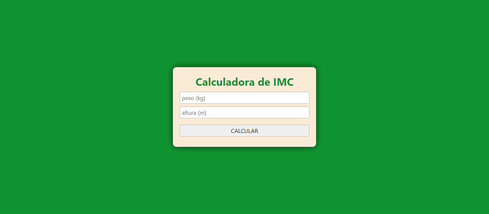
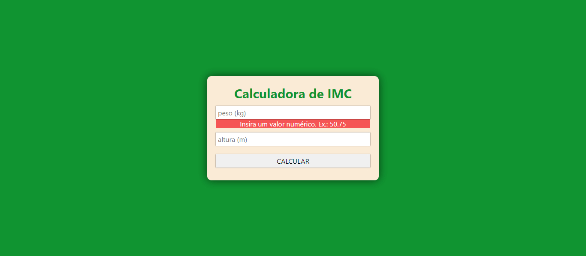
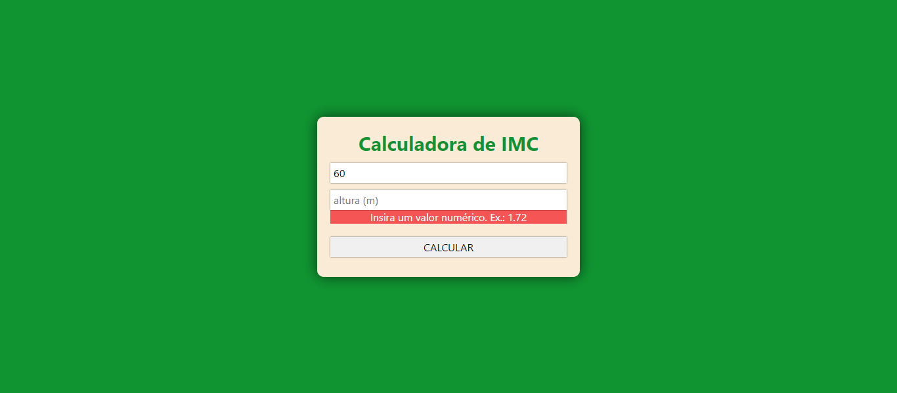
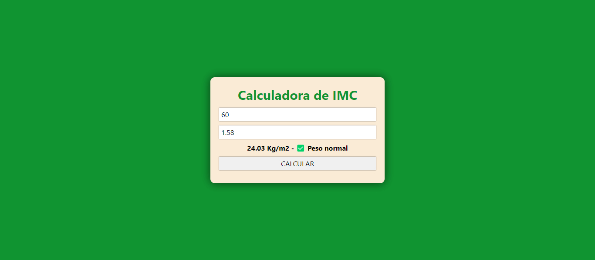

# Calculadora de IMC

## ℹ️ Sobre o projeto

Trata de uma calculadora simples para cálculo do Índice de Massa Corporal (IMC) com foco principal na implementação da lógica de cálculo em JavaScript.

> Este projeto foi desenvolvido como parte avaliativa do curso Introdução a Back-end development, unidade 1, da iTalets.

## 💻 Tecnologias utilizadas


          

## 🚀 Funcionalidades

- **Cálculo do IMC** - bmiCalculate(mass, height): permite calcular o peso corporal com base na relação `peso / (altura * altura)` - os valores são capturados por meio de inputs (html).

- **Classificação do IMC**: com o resultado do cálculo, a função ` bmiClassification(bmi)` recebe o valor e classifica-o entre 'Abaixo do peso', 'Peso normal', 'Sobrepeso' e 'Obesidade'.

- **validateData()**: função utilizada para verificar se os valores foram informados. Quando negativo, uma mensagem é exibida solicitando a entrada do dado - `ver ## ✅ Resultados obtidos`.


## 📝 Como usar

### 🏠 Teste local
 - Clone o repositório, acesse o diretório do projeto e dê um duplo clique no arquivo index.html
 ```bash
 git clone https://github.com/giovanesouza/simple-bmi-calculator.git
 cd simple-bmi-calculator
 ```

### ☁️ Teste remoto

Acesse o projeto que está publicado no github pages clicando [aqui](https://giovanesouza.github.io/simple-bmi-calculator/)


## ✅ Resultados obtidos

### Calculadora sem valores inseridos


### Verificação de preenchimento do `campo Peso`


### Verificação de preenchimento do `campo Altura`


### Resultado do IMC


